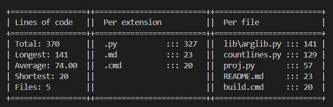

# Tools

Some tools i use every day.

I recommend putting these in $PATH

## [Proj](https://raw.githubusercontent.com/Omena0/tools/refs/heads/main/dist/countlines.exe)

Create a new project quickly.

Usage: `proj [mk|rm|mv|ls] [project name]`

## [Countlines](https://raw.githubusercontent.com/Omena0/tools/refs/heads/main/dist/countlines.exe)

Count lines of code in a directory

Counts all text files that are not in gitignore
and sorts them from highest to lowest.

Ignores dotfiles

Usage: `countlines <[path]='.'>`
